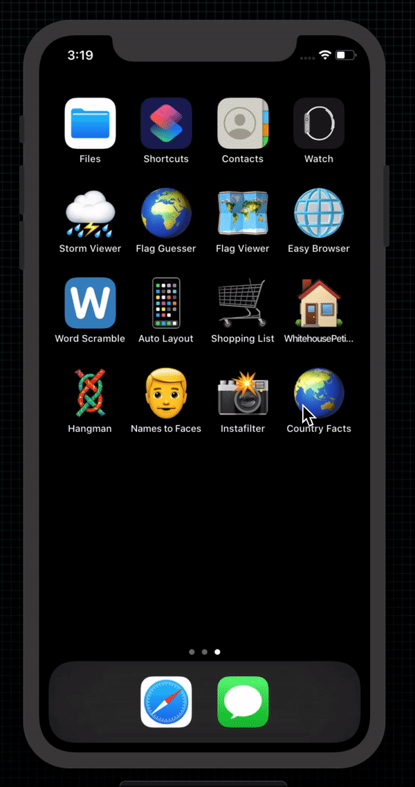

# Country Facts

  

 
An application that contains facts about countries.

## Examples within this code
- Table Views
- View controllers
- Storyboards
- Interface Builder
- Codable
- Downloading JSON with Data

## Demonstration
Small demonstration as to what the application does when on device.
 

